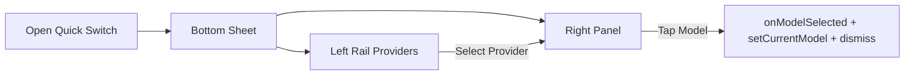
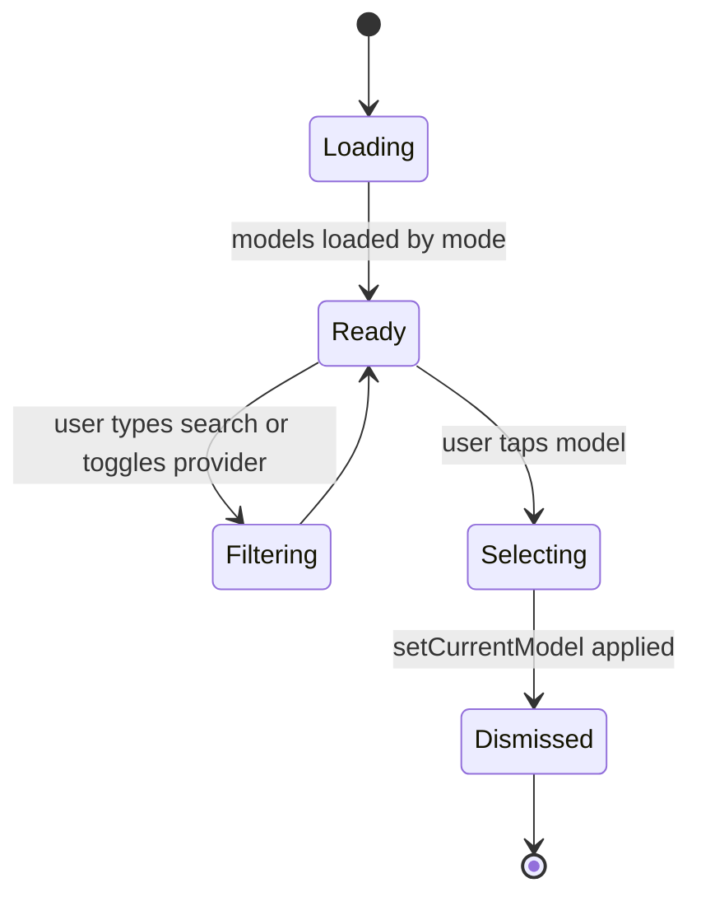

# Model Quick Switcher — Two‑Pane Bottom Sheet

Purpose
- Provide a fast, provider‑grouped model switcher similar to the reference menu in the second screenshot.
- Respect the current ChatMode (ChatMode.chat vs ChatMode.deepSearch) and only show/select models valid for the active mode.
- Keep selection semantics, pricing and capability badges consistent with the existing selector.

Scope
- New compact quick switcher launched from the chat composer/model pill as a modal/bottom sheet.
- Two-pane layout:
  - Left rail: provider categories (Gemini, OpenAI, Claude, Llama, DeepSeek, Grok, Qwen, Moonshot, Z.ai, Stealth, Free)
  - Right panel: dense list of models for the selected provider/category with capability and price badges.
- On tap, immediately switches model for the current mode and dismisses.

Data Source and Contracts
- Uses ModelService.getEnhancedModelsByMode(mode) exactly like [lib/screens/model_selection_screen.dart:937](lib/screens/model_selection_screen.dart:937).
- Accepts and forwards the same constructor inputs as the full selector to maintain behavior:
  - mode: ChatMode (required)
  - selectedModel: String (current model id)
  - onModelSelected(String): callback
- Selection must also update runtime client state via LLMService().setCurrentModel(modelId) like [lib/screens/model_selection_screen.dart:1015](lib/screens/model_selection_screen.dart:1015).

Mode Awareness
- The quick switcher is instantiated with the active ChatMode (ChatMode.chat or ChatMode.deepSearch).
- It calls ModelService.getEnhancedModelsByMode(mode) so only the models applicable to that mode are shown.
- When switching, it calls _selectModel for the current mode, so different modes can retain different last‑used models if your app tracks them upstream. If you maintain per‑mode selection in a provider, wire the onModelSelected to that storage.

Provider Normalization
- Provider field candidates per model:
  - model["provider"] as String?
  - model["top_provider"]["name"] as String?
- Normalization map (keys are lowercase):
  - "google" → "Gemini"
  - "anthropic" → "Claude"
  - "x-ai", "xai" → "Grok"
  - "meta" → "Llama"
  - "mistral", "mistralai" → "Mistral"
  - "deepseek" → "DeepSeek"
  - "openai" → "OpenAI"
  - "qwen" → "Qwen"
  - Others → TitleCase of original
- The special category "Free":
  - Aggregate all models that are free by the same logic used today.

Free Detection (identical to current logic)
- Primary: model["isFree"] == true
- Fallback 1: model["id"] endsWith ":free"
- Fallback 2: model["id"] contained in knownFreeModels set used in [lib/screens/model_selection_screen.dart:134](lib/screens/model_selection_screen.dart:134)
- Fallback 3: pricing fields input/output or prompt/completion are both zero

Modalities, Badges, Pricing
- Input modalities extraction mirrors current implementation:
  - model["inputModalities"] or model["input_modalities"] or model["architecture"]["input_modalities"]
  - Default to "text" if empty
- Badges shown in the row:
  - Text (always)
  - Images if modalities contains "image"
  - Files if modalities contains "file"
  - Price chip via _getPriceDisplay(pricing) behavior identical to [lib/screens/model_selection_screen.dart:819](lib/screens/model_selection_screen.dart:819)
  - Optional: context length chip if model["contextLength"] or model["context_length"] available
- Provider icons reuse _getProviderIcon(provider) from [lib/screens/model_selection_screen.dart:906](lib/screens/model_selection_screen.dart:906)

UX Behavior
- Launch: from tapping the current model chip/pill or a "Switch model" action; opens a rounded top bottom sheet covering ~70–85% screen height.
- Left rail:
  - Scrollable list of providers in normalized order:
    Gemini, OpenAI, Claude, Llama, DeepSeek, Grok, Qwen, Moonshot, Z.ai, Stealth, Free
  - Show counts per provider (optional), highlight active provider.
- Right panel:
  - Search field at top filters only within selected provider/category.
  - Dense, single-line rows with:
    - Model name
    - Compact capability icons (👁 for images, 🧩 for tools/files, ✍ text is implicit) and price chip on the trailing side.
  - Tapping a model:
    - Calls onModelSelected(modelId)
    - Calls LLMService().setCurrentModel(modelId)
    - Pops the sheet
- Long-press or info icon on a row can open the existing capabilities sheet shown in your first screenshot.

Error/Loading/Empty States
- Loading: small linear progress in right panel + skeleton rows.
- Error loading models: reuse the existing error visual style from _buildErrorState but in compact form inside the sheet.
- Empty filter results: "No models" hint in the right panel; left rail remains visible.

Accessibility and Performance
- Items sized for touch: 44–56px row height.
- 60 FPS scrolling: list is virtualized with ListView.builder.
- Semantic labels for icons and rows.
- Keep print() debug logs behind a feature flag or assert to avoid noisy production logs.

Wireframe

State Diagram

File/Component Plan
- New widget: lib/screens/model_quick_switcher.dart
  - Constructor: mode, selectedModel, onModelSelected
  - Internal state:
    - providersIndexed: Map<String, List<Map<String, dynamic>>>
    - freeModels: List<Map<String, dynamic>>
    - selectedProvider: String
    - searchQuery: String
    - isLoading, error
  - Methods:
    - _loadModelsByMode() → calls ModelService.getEnhancedModelsByMode(mode) [lib/screens/model_selection_screen.dart:937](lib/screens/model_selection_screen.dart:937)
    - _normalizeProvider(...)
    - _isFree(...)
    - _buildLeftRail(...)
    - _buildRightList(...)
    - _selectModel(modelId) → same as [lib/screens/model_selection_screen.dart:1011](lib/screens/model_selection_screen.dart:1011)
- Invocation:
  - From the chat screen/model chip:
    - showModalBottomSheet(context: ..., useSafeArea: true, isScrollControlled: true, builder: (_) => ModelQuickSwitcher(...))
- Reuse:
  - Copy or extract helpers:
    - _getProviderIcon from [lib/screens/model_selection_screen.dart:906](lib/screens/model_selection_screen.dart:906)
    - _getPriceDisplay from [lib/screens/model_selection_screen.dart:819](lib/screens/model_selection_screen.dart:819)
    - Modality extraction logic from [lib/screens/model_selection_screen.dart:455](lib/screens/model_selection_screen.dart:455)

Acceptance Criteria
- When opened in ChatMode.chat, only chat‑mode models appear; DeepSearch models do not, and vice‑versa.
- Providers in left rail group models correctly using the normalization map; Free shows all free models across providers.
- Selecting a model immediately switches the active model for the current mode, updates LLMService current model, and dismisses.
- Search filters within the selected provider or Free category only.
- Badges and pricing match current card list logic for the same model object.
- Works in light/dark themes and on small/large screens.

Out‑of‑Scope
- Server‑side changes to model metadata.
- Persisting last selected provider across app launches (can be added via Provider if desired).

Future Enhancements
- Pin favorites per mode at the top of the right panel.
- Recent models section per mode.
- Show per‑mode cost estimate based on CostService integration.
- Allow keyboard navigation and shortcuts on desktop.

Implementation Steps (high level)
1) Implement ModelQuickSwitcher widget and data shaping (mode‑aware load, provider index, free list).
2) Build left rail and right panel with dense rows and badges.
3) Wire selection to onModelSelected + LLMService().setCurrentModel.
4) Add entry point in the chat UI (model pill/button).
5) QA: validate providers grouping, Free logic, mode scoping, pricing display, and selection side effects.
