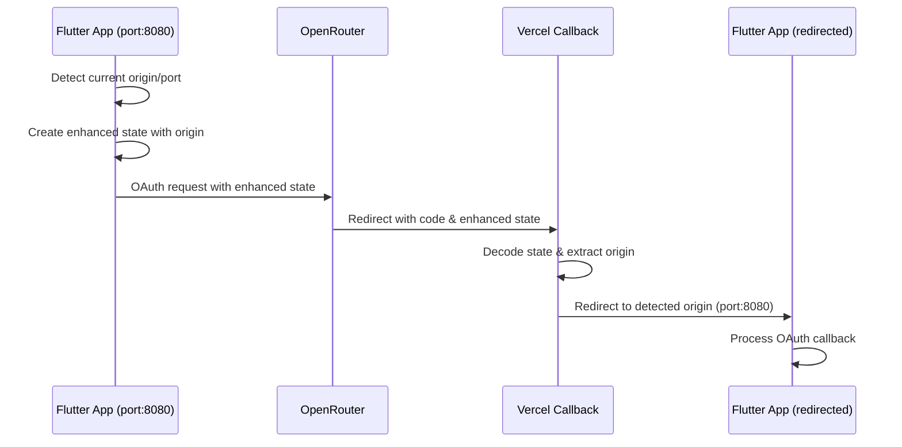

# OAuth Dynamic Callback Solution - Complete Implementation Plan

## Problem Summary

Your Flutter app currently uses a hardcoded Vercel callback URL (`https://oauth-callback-deploy-grzgl2jm7-umeranjum17s-projects.vercel.app/callback`), causing issues when developing on different ports (3000, 8080, etc.). The callback always redirects to `localhost:3000`, breaking the OAuth flow for developers using other ports.

## Solution Overview

**State-Based Origin Tracking**: Encode the originating environment (URL + port) into the OAuth state parameter, allowing the Vercel callback handler to redirect back to the correct development environment automatically.

## Architecture Flow



## Implementation Components

### 1. Flutter App Components (3 new files)

#### **`lib/services/environment_service.dart`**
- **Purpose**: Automatic environment and port detection
- **Features**: 
  - Web origin detection from `window.location`
  - Platform detection (web/mobile/desktop)
  - Port extraction and validation
  - Origin whitelist validation

#### **`lib/models/oauth_state.dart`**
- **Purpose**: Enhanced OAuth state management
- **Features**:
  - Base64URL encoding/decoding
  - Origin information storage
  - Timestamp validation
  - Security validation methods

#### **Updated `lib/providers/oauth_auth_provider.dart`**
- **Changes**: 
  - Use enhanced state with origin info
  - Dynamic callback URL generation
  - Improved state validation
  - Backward compatibility maintained

### 2. Vercel Callback Handler Update

#### **Enhanced `oauth-callback-deploy/index.html`**
- **Features**:
  - Enhanced state parameter decoding
  - Dynamic redirect logic based on origin
  - Platform-aware redirection (web vs mobile)
  - Comprehensive fallback strategies
  - Debug mode for development
  - Security validations

## Key Benefits

✅ **Automatic Port Detection**: Works with any development port (3000, 8080, 8081, etc.)  
✅ **Zero Configuration**: No manual setup required for different ports  
✅ **Secure**: Uses existing OAuth security mechanisms  
✅ **Backward Compatible**: Existing functionality preserved  
✅ **Platform Agnostic**: Works on web, mobile, and desktop  
✅ **Developer Friendly**: Seamless development experience  

## Security Features

### **State Parameter Security**
- Base64URL encoding for URL safety
- Timestamp validation (10-minute window)
- Origin whitelist validation
- Required field validation
- Replay attack prevention

### **Origin Validation**
- Whitelist of allowed origins (localhost, your domains)
- Protocol validation (http/https)
- Comprehensive error handling

## Implementation Strategy

### **Phase 1: Flutter Implementation** ✅
- Create `EnvironmentService` for automatic detection  
- Create `OAuthState` for enhanced state management  
- Update `OAuthAuthProvider` with dynamic callback logic  

### **Phase 2: Vercel Handler Update** ✅
- Enhance callback handler with state decoding  
- Implement dynamic redirect logic  
- Add comprehensive fallback mechanisms  
- Include debug support for development  

### **Phase 3: Testing & Validation** (Next Steps)
- Test across different development ports
- Validate production scenarios
- Test security mechanisms
- Performance testing

## Best Practices Implemented

### **Development Experience**
- **Automatic Detection**: No manual configuration needed
- **Multiple Fallbacks**: Graceful degradation if primary method fails
- **Debug Support**: Comprehensive logging for troubleshooting
- **Error Handling**: Clear error messages and recovery strategies

### **Security**
- **Minimal Attack Surface**: Uses existing OAuth security
- **Validation Layers**: Multiple security checks
- **Time-bounded**: State parameters expire after 10 minutes
- **Origin Restricted**: Only allowed domains can receive callbacks

### **Maintainability**
- **Backward Compatible**: Current implementation remains as fallback
- **Modular Design**: Clear separation of concerns
- **Well Documented**: Comprehensive documentation and examples
- **Testable**: Easy to unit test and validate

## Next Steps for Implementation

### **Immediate Actions**
1. **Switch to Code Mode**: Implement the Flutter components
2. **Test Current Setup**: Verify basic functionality works
3. **Update Vercel Handler**: Deploy the enhanced callback handler
4. **Comprehensive Testing**: Test across different scenarios

### **Testing Strategy**
```bash
# Test different ports
flutter run -d chrome --web-port 3000
flutter run -d chrome --web-port 8080  
flutter run -d chrome --web-port 8081

# Test production scenario
flutter build web --release
```

### **Validation Checklist**
- [ ] Origin detection works correctly on different ports
- [ ] State encoding/decoding functions properly
- [ ] OAuth flow completes successfully on all test ports
- [ ] Callback redirects to correct originating port
- [ ] Security validations pass (timestamp, origin, etc.)
- [ ] Fallback mechanisms work when primary approach fails
- [ ] Mobile and desktop platforms work correctly
- [ ] Production deployment functions properly

## Migration Benefits

**Before**: Hardcoded callback URL → Always redirects to localhost:3000  
**After**: Dynamic callback URL → Automatically redirects to originating environment  

**Developer Impact**: Zero - the change is transparent to developers  
**User Impact**: Zero - users see no difference in authentication flow  
**Security Impact**: Positive - additional validation layers added  

## Configuration Management

### **Development**
- Automatic port detection
- Debug mode enabled
- Localhost-only origins allowed

### **Production**
- Production domains in origin whitelist
- Debug mode disabled
- Enhanced security validations

## Implementation Files Created

1. **`oauth_dynamic_callback_implementation.md`** - Complete Flutter implementation guide
2. **`vercel_callback_handler_update.md`** - Enhanced Vercel handler implementation
3. **`oauth_dynamic_callback_summary.md`** - This summary document

## Ready for Code Implementation

The architecture is complete and ready for implementation. The solution provides:

- **Comprehensive**: Covers all aspects of dynamic callback handling
- **Secure**: Implements OAuth security best practices
- **Maintainable**: Clear, modular design with good separation of concerns
- **Developer-Friendly**: Automatic detection with zero configuration required

**Next Step**: Switch to Code mode to implement the Flutter components and test the solution.